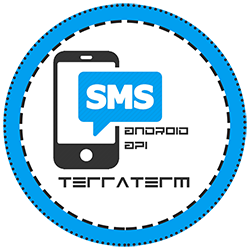

# Terra Term

[{.img}](https://github.com/neetmon/terra_term)

Terra Term is an Cordova Base SMS application that makes your mobile phone as a reveiving end-point for your sms-transport-data-layer. As a sms arrives on your phone the terra term then call a webhook on your server to process the incoming sms message. Basic settings and options are available as this is just a simple trial for the sole purpose of bridging the transport-layer for your application. This serve on a medium for android phones to connect to your webhooks.

To build the project
```
cordova run android
```

<style>
	img[alt="TerraTerm"] { 
	  width:  250px; 
	}
</style>
